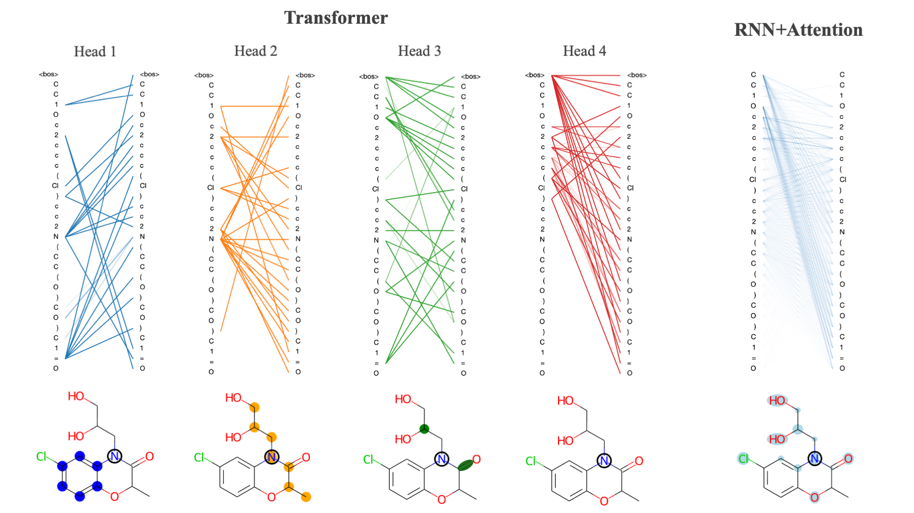

# Giving Attention to Generative VAE Models for _De Novo_ Molecular Design

This repo contains the codebase for attention-based implementations of popular VAE models for molecular design as described in this paper (note - link paper). The addition of attention allows models to learn longer range dependencies between input features and improves the quality and interpretability of learned molecular embeddings. The code is organized by folders that correspond to the following sections:
*transvae*
  - Contains all code required to run models including model class definitions, data preparation, optimizers, etc.
*scripts*
  - Contains scripts for training models, generating samples and performing calculations
*notebooks*
  - Contains jupyter notebook tutorials and example calculations
*checkpoints*
  - Contains a sample of saved pre-trained model files
*data*
  - Contains token vocabularies and weights for ZINC and PubChem datasets (***note - full train and test sets available for download here)

There are three model types - RNN, RNNAttn and Transformer.
